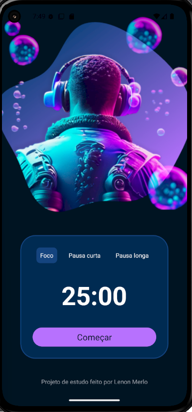
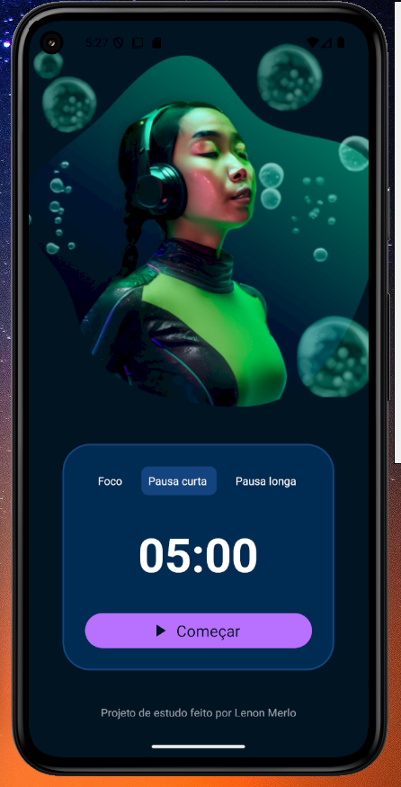

# 🧠 Fokus - Time Manager

**Fokus** é um aplicativo de gerenciamento de tempo baseado na técnica Pomodoro, desenvolvido com **React Native + Expo**.

O objetivo é melhorar sua produtividade e bem-estar por meio de ciclos de foco e pausas, de forma simples e intuitiva.

---

## 🎯 Funcionalidades

- ⏱ Ciclo de foco com temporizador de 25 minutos
- 💤 Pausa curta (5 minutos)
- 🛌 Pausa longa (15 minutos)
- 🎨 Interface moderna e responsiva
- 📱 Visualização otimizada para dispositivos móveis Android (emulador ou físico)
- 🧘‍♂️ Ideal para estudo, trabalho, concentração e descanso consciente

---

## 🚀 Tecnologias utilizadas

- [React Native](https://reactnative.dev/)
- [Expo](https://expo.dev/)
- [JavaScript](https://developer.mozilla.org/en-US/docs/Web/JavaScript)
- [StyleSheet](https://reactnative.dev/docs/stylesheet) para estilização

---

## 📷 Preview





---

## 📦 Como rodar o projeto

1. Clone o repositório:
```bash
git clone https://github.com/lenonmerlo/fokus-time-manager.git
```

2. Instale as dependências:
```bash
npm install
```

3. Inicie o projeto com o Expo:
```bash
npx expo start
```

4. Rode no seu celular com o app **Expo Go** ou em um **emulador Android**

---

## ✍️ Autor

Desenvolvido por [Lenon Merlo](https://github.com/lenonmerlo) 👨‍💻  
Projeto com fins educacionais e experimentais.

---

## 📄 Licença

MIT